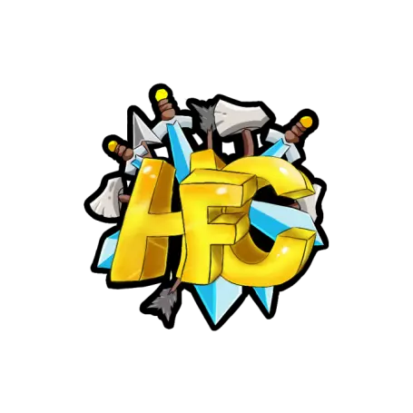

  <h1>HFCraft 👋</h1>
  <h3>Um servidor construido pela comunidade</h3>
  <h4>
    Sobre esse repositorio, esse é o repositorio do site do <a href="https://hf.fegasa.tk/">HFCraft</a>
  </h4>
  <a href="https://discord.gg/xVZNFtKgSs" />
  </img>
  <a href="https://twitch.tv/antonyzera" />
  </img>
  <a href="https://github.com/gabriewf/HFCraft" />
  

<h2>Lista de Softwares usados!</h2>

-  <strong>TailwindCSS</strong>
-  <strong>PostCSS</strong>
-  <strong>NextJS</strong>
-  <strong>Prettier</strong>
-  <strong>ESLint</strong>
-  <strong>Firebase</strong>
-  <strong>React</strong>
-  <strong>Preact</strong>

<h2>Observações</h2>
<strong>Observe o Node 14</strong>
 
<strong>e o Yarn é necessário.</strong>
 
 
<strong>Você também pode clonar este repositório e construí-lo você mesmo.</strong>

<h2>Licença do Projeto</h2>
Exceto os arquivos na pasta <strong>public</strong>
 
O resto do arquivos são licenciados com a licença <strong>Boost Software License 1.0 (BSL-1.0)</strong>.
 
 
